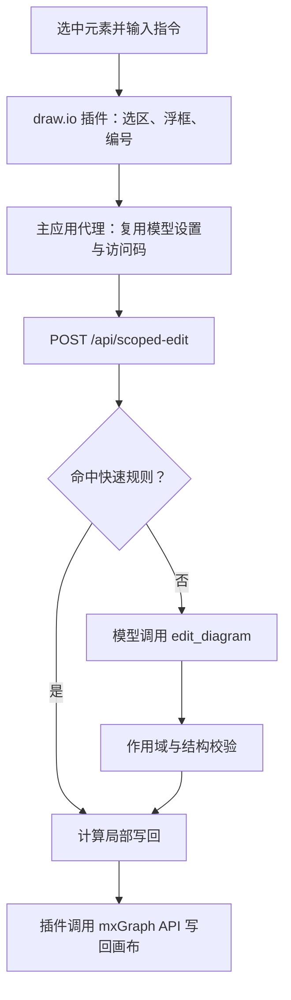

# Next AI Draw.io · AI 局部修改版

在 draw.io 画布中选中元素，用一句话完成局部修改。

本项目基于 [DayuanJiang/next-ai-draw-io](https://github.com/DayuanJiang/next-ai-draw-io)，保留聊天绘图能力，并增加选区感知的局部编辑插件：选中元素、右键打开浮框、输入修改要求，再把允许的操作写回画布。

**环境安装与项目安装是两个独立步骤。默认部署只负责安装、启动和检查服务可访问性，不执行局部编辑规则冒烟，也不调用模型。**

- 本仓库：[1494350447/next-ai-draw-io-scoped](https://github.com/1494350447/next-ai-draw-io-scoped)
- 上游基线：`027cd88c9088ad5b2d6deff4641dc47ded06afd2`
- 推荐部署方式：Linux 单机 + Docker Compose
- 默认模型配置：DeepSeek，模型 ID 可自行配置
- 许可证：[Apache-2.0](upstream/LICENSE)

## 目录

- [项目简介](#项目简介)
- [功能说明](#功能说明)
- [快速开始](#快速开始)
- [环境要求](#环境要求)
- [安装环境](#安装环境)
- [安装项目](#安装项目)
- [模型与地址配置](#模型与地址配置)
- [使用局部修改](#使用局部修改)
- [常用运维命令](#常用运维命令)
- [更新与数据保存](#更新与数据保存)
- [打包与迁移](#打包与迁移)
- [项目结构与架构](#项目结构与架构)
- [开发与验证](#开发与验证)
- [常见问题](#常见问题)
- [已知边界](#已知边界)
- [相关文档与致谢](#相关文档与致谢)

## 项目简介

适用于流程图、系统架构图、业务关系图等需要反复调整的绘图工作。

例如，一张图已经画好，只想调整其中几个框的对齐、颜色、尺寸或文字。使用本项目时，可以直接在画布上选中这些元素并输入要求，减少截图圈选、解释元素位置和反复在主聊天窗口描述范围的操作。

本仓库包含两部分定制：

1. **draw.io 插件**：读取选区、提供右键入口与悬浮指令框、展示可选编号、写回图形。
2. **Next AI Draw.io 应用扩展**：复用模型配置，提供局部编辑接口、快速规则和作用域检查。

`upstream/` 是随仓库保存的完整定制源码，不是 Git 子模块。安装本项目无需另行克隆原版上游；仅复制插件到任意上游版本，并不能获得这里的完整功能。

## 功能说明

### 绘图能力

| 能力 | 说明 |
| --- | --- |
| 聊天生成图形 | 在主聊天窗口描述流程、结构或关系，生成可编辑图形 |
| 聊天修改图形 | 通过后续对话调整当前图形 |
| draw.io 手动编辑 | 使用画布原有的形状、连接线、布局和样式工具 |
| 参考内容输入 | 继承上游的图片、PDF、文本输入能力；具体效果受所选模型能力影响 |
| 图形导出 | 应用支持 .drawio、PNG、SVG 等导出形式，便于保存和继续编辑 |
| 模型配置 | 支持服务端默认模型，也支持主应用中的模型设置 |

### 局部修改能力

| 能力 | 当前行为 |
| --- | --- |
| 选区编辑 | 修改前先在画布上选中一个或多个元素 |
| 右键入口 | 「AI 局部修改…」位于「删除」下方，使用绿色字体 |
| 悬浮指令框 | 在画布附近输入指令，支持多行输入 |
| 快速规则 | 对齐、分布、等尺寸、改色、形状、移动等常见指令优先用确定性规则 |
| 模型处理 | 规则未命中时，自动进入模型通道，无需再点击一次“交给模型” |
| 局部增删 | 支持局部新增、删除，并对父容器、ID、连接端点等进行检查 |
| 显示编号 | 默认关闭；开启后在当前操作选区显示 ①、②、③ 等临时编号 |
| 等待提示 | 执行期间显示处理提示，结束后说明使用了规则还是模型 |
| 关闭面板 | 点击 ×、在输入框按 Escape，或点击空白画布清空选区 |

编号定位会响应已监听的滚动、视图缩放/平移和模型变化。编号的稳定性、模型处理及撤销限制见[已知边界](#已知边界)。

## 快速开始

### 1. 获取项目

已安装 Git，并且账号具有仓库访问权限时：

```bash
git clone https://github.com/1494350447/next-ai-draw-io-scoped.git
cd next-ai-draw-io-scoped
```

也可以下载完整源码压缩包后解压进入项目根目录。私有仓库需要先登录有权限的 GitHub 账号；环境安装脚本不负责安装 Git 或配置 GitHub 认证。

### 2. 安装或检查环境

Ubuntu 24.04 首次准备环境：

```bash
./install-env.sh
```

已安装好 Docker、Compose 等依赖时，只做检查：

```bash
./install-env.sh --check
```

### 3. 安装项目

```bash
./setup.sh
```

首次在交互终端执行且不存在 `.env` 时，会询问 DeepSeek 模型 ID 和 API key。密钥输入不回显，生成的 `.env` 权限为 `600`。已有 `.env` 会保留。

### 4. 打开应用

| 地址 | 用途 |
| --- | --- |
| <http://127.0.0.1:3000/> | 主应用：聊天绘图及画布 |
| <http://127.0.0.1:3000/drawio/index.html> | 同源代理的 draw.io 编辑器；日常从主应用使用 |

建议从主应用进入画布，局部编辑会通过主应用代理复用页面中的模型配置。

服务启动成功表示应用和画布已就绪。**由于默认安装不调用模型，它不代表 API key、模型额度和模型输出质量已经验证。**

## 环境要求

| 项目 | 要求或说明 |
| --- | --- |
| 操作系统 | Linux；自动安装依赖仅支持 Ubuntu 24.04 |
| Docker Engine | 24.0.0 或更新版本，daemon 已启动且当前用户有访问权限 |
| Docker Compose | 2.24.4 或更新版本，使用 `docker compose` 命令 |
| Python | 3.9 或更新版本，用于部署配置和资产生成 |
| 其它工具 | Bash、curl、ss（iproute2）、sha256sum 等 Linux 基础工具 |
| 端口 | 应用宿主端口可用，默认 3000；draw.io 不发布宿主端口 |
| 磁盘 | 建议预留至少 6 GiB，构建缓存会额外占用空间 |
| 构建网络 | 能访问 Docker 镜像仓库、Alpine 软件源和配置的 npm 源 |
| 模型网络 | 使用 AI 功能时，应用容器需能访问模型提供方 |
| 模型账号 | 默认使用 DeepSeek；需提供有效 key 和服务商支持的模型 ID |

正常容器部署不要求宿主机安装 Node.js、npm 或 PyYAML，应用依赖在镜像内安装。

默认 npm 源为 `https://registry.npmmirror.com`。系统 APT 使用机器已有配置，不会自动替换全局软件源。桌面客户端、Windows 原生安装和 macOS 原生脚本执行不在这套部署脚本的验证范围内。

## 安装环境

环境脚本：[install-env.sh](install-env.sh)。

```bash
./install-env.sh          # 安装缺失依赖，然后检查环境
./install-env.sh --check  # 只检查，不安装
./install-env.sh --help
```

环境安装脚本负责：

- 在 Ubuntu 24.04 上按需安装 Docker、Compose、Python、curl、iproute2、coreutils。
- 使用系统已配置的 APT 源；安装需要 root 或 sudo 权限。
- 新安装 Docker 时，通过 systemctl 启用服务。
- 检查 Docker、Compose、Python 的最低版本，以及当前用户能否访问 Docker。

它可以单独复制运行，不需要 `upstream/`、模型 key 或 `.env`，也不会构建应用镜像或启动项目。

已有软件不会被主动升级以满足版本要求；版本过低时会报告错误，由管理员处理。脚本不自动修改 Docker 用户组。遇到 daemon 未启动或访问权限不足时，先由管理员处理，再重新运行检查。

其它 Linux 发行版请自行准备依赖，随后运行 `./install-env.sh --check`。

## 安装项目

项目入口：[setup.sh](setup.sh)。部署与运维底层入口：[deploy.sh](deploy.sh)。

### 交互安装

```bash
./setup.sh
```

项目脚本依次执行：

1. 检查环境、版本、项目源码、端口和磁盘。
2. 检查配置；首次使用时引导填写 DeepSeek 模型和 key。
3. 生成插件入口与缓存指纹，构建应用镜像，准备固定版本 draw.io 镜像。
4. 启动两个容器，等待 HTTP 就绪，核对在线插件文件。
5. 输出服务状态和访问地址。

环境安装和项目安装不会相互自动串联：项目发现缺少系统依赖时会提示处理，不会自行安装系统包。

### 手动配置或无人值守安装

```bash
./deploy.sh init
```

编辑生成的 `.env`，确认模型与 key，然后执行：

```bash
./setup.sh
```

非交互终端中如果没有 `.env`，脚本会创建模板并退出，等待填写后重跑。模板的 key 留空，不会使用空 key 继续安装。

### 仅检查项目

```bash
./setup.sh --check
```

这会检查环境和已有配置，不构建、不启动服务，也不创建 `.env`。与 `install-env.sh --check` 的区别是：项目检查要求项目源码和模型配置已准备好。

`setup.sh --install-deps` 和 `setup.sh --with-ai` 已移除。日常安装只使用上述两个独立入口。

## 模型与地址配置

完整模板见 [.env.example](.env.example)。真实凭据只写入本机 `.env`，不要填回模板。

### 默认配置

```dotenv
AI_PROVIDER=deepseek
AI_MODEL=deepseek-flash
DEEPSEEK_API_KEY=

DEEPSEEK_BASE_URL=
ACCESS_CODE_LIST=
ADMIN_PASSWORD=

APP_BIND_ADDRESS=0.0.0.0
APP_PORT=3000
COMPOSE_PROJECT_NAME=next-ai-draw-io
NEXT_PUBLIC_BASE_PATH=
DRAWIO_PUBLIC_URL=
AI_SCOPE_ENDPOINT=
NPM_REGISTRY=https://registry.npmmirror.com
```

示例故意不填写 key，使用前必须补齐。`deepseek-flash` 是当前模板的模型 ID，不代表所有提供方或账号均支持该模型；以服务商实际提供的 ID 为准。

### 配置项说明

| 变量 | 用途 | 修改后如何生效 |
| --- | --- | --- |
| `AI_PROVIDER` | 服务端默认模型提供方 | `./deploy.sh up` |
| `AI_MODEL` | 服务端默认模型 ID | `./deploy.sh up` |
| `DEEPSEEK_API_KEY` | DeepSeek 凭据；使用该提供方时必填 | `./deploy.sh up` |
| `DEEPSEEK_BASE_URL` | 可选的 DeepSeek API 地址 | `./deploy.sh up` |
| `ACCESS_CODE_LIST` | 可选访问码，多个码用逗号分隔；留空不校验 | `./deploy.sh up` |
| `ADMIN_PASSWORD` | 可选后台密码；留空禁用 /admin | `./deploy.sh up` |
| `APP_BIND_ADDRESS` / `APP_PORT` | 应用宿主监听地址和端口，默认 `0.0.0.0:3000` | `./deploy.sh up` |
| `COMPOSE_PROJECT_NAME` | 实例名称；多实例使用独立项目目录和数据 | 创建新实例，不会自动迁移旧实例 |
| `NEXT_PUBLIC_BASE_PATH` | 应用路径前缀，默认空；例如 `/diagram`，无尾斜杠 | `./deploy.sh deploy` 重建应用 |
| `DRAWIO_PUBLIC_URL` | 浏览器加载的 draw.io 地址，属于构建参数 | `./setup.sh` 重建应用 |
| `AI_SCOPE_ENDPOINT` | 独立画布的直连应用根地址，默认自动推导；嵌入模式通过主应用请求 | `./deploy.sh up`，然后刷新页面 |
| `NPM_REGISTRY` | 镜像构建使用的 npm 源 | `./setup.sh` 重建应用 |

页面上出现的默认模型来自服务端配置；前端选择的模型设置可以覆盖默认配置。局部编辑通过主应用代理时复用这些设置。

若改用其它模型提供方，请同时调整 `AI_PROVIDER`、`AI_MODEL` 和对应凭据，参考 [上游配置模板](upstream/env.example) 与 [提供方实现](upstream/lib/ai-providers.ts)。首次交互向导面向 DeepSeek，其它提供方使用手动配置方式。

### 局域网访问

保持画布地址和插件地址留空，从浏览器访问 `http://服务器IP:3000/`。页面、画布和 API 使用同一个入口，无需开放 8080：

```dotenv
DRAWIO_PUBLIC_URL=
AI_SCOPE_ENDPOINT=
```

3000 被占用时设置 `APP_PORT=3300`，执行 `./deploy.sh up`，访问服务器的 3300 端口。更换 IP、域名或 HTTPS 不需要重新构建默认同源镜像。

旧版配置中的 `localhost:8080` 或 `服务器IP:8080` 不会自动清除。迁移时将上述两项留空，执行 `./deploy.sh deploy` 重建应用。域名 HTTPS、子路径、独立画布和多实例部署见 [服务器部署方案](docs/SERVER_DEPLOYMENT.md)。

## 使用局部修改

### 基本操作

1. 在主应用中生成图形，或打开已有图形。
2. 在画布上选中要修改的一个或多个元素。
3. 右键，点击「删除」下面绿色的「AI 局部修改…」。
4. 在悬浮框输入要求。
5. 点击「执行」，或按 `Ctrl + Enter` / `Cmd + Enter`。
6. 查看结果提示，确认修改符合预期。

输入框支持多行。优先一次描述一个明确目标，复杂修改可拆成几步。

### 常见指令

| 目标 | 示例 | 使用提示 |
| --- | --- | --- |
| 对齐 | 左对齐、顶对齐、垂直居中 | 选中多个元素后执行 |
| 分布 | 水平等距分布、垂直等距分布 | 选中适量元素并保留期望的整体范围 |
| 尺寸 | 等宽、等高、统一大小 | 默认规则作用于选区，参考语义以实现为准 |
| 颜色 | 变绿、把边框改成红色 | 指明是填充、边框还是文字 |
| 形状 | 变成正方形、变成梯形、变成菱形 | 注意检查转换后的文字与连接线 |
| 位置 | 向右移动 20、向上移动 10 | 数值按图形几何单位处理，非固定屏幕像素 |
| 文字 | 将①的文字替换为入口 | 开启编号后更容易明确目标 |
| 新增 | 在旁边加一个同色圆角框 | 新增有父容器与结构约束 |
| 删除 | 删掉选中的 | 可能连带删除关联连线 |

快速规则先匹配，未命中再由模型生成操作。返回结果还要经过服务端作用域检查，插件才执行写回。

### 显示与隐藏编号

编号默认关闭。点击「显示编号」后，在当前操作选区展示 ①、②、③；再次点击「隐藏编号」关闭。

编号会随请求映射到真实 cell ID，而不是作为文字插进图形 XML。可以使用「将①的文字替换为入口」这样的描述。

当前编号按空间位置排列，并可能在移动、缩放或视图刷新后重新排序。复杂的“参照①，只修改②”尚有规则匹配限制，不能把所有含编号的句子都视为可靠的精确操作。

### 关闭与等待

- 点击 × 或在输入框按 Escape，关闭面板。
- 左键点击画布空白处清空选区，面板与编号一起消失。
- 选择另一组元素后，重新右键打开面板，使用新的作用域。
- 等待提示按耗时显示阶段文案，尚不是服务端实时进度。
- 关闭面板不等于取消已经发出的请求。

项目没有额外的「复原上一次 AI 改动」面板按钮。draw.io 原生撤销入口仍在，但主应用同步 XML 时存在历史撤销限制；重要修改前建议导出图形副本。

## 常用运维命令

以下命令都在项目根目录执行。

| 命令 | 作用 |
| --- | --- |
| `./install-env.sh --check` | 只检查系统依赖及 Docker 权限 |
| `./setup.sh --check` | 检查项目环境、配置及生成物 |
| `./setup.sh` | 配置、构建、启动项目 |
| `./deploy.sh init` | 创建 .env 模板，已有配置不覆盖 |
| `./deploy.sh environment` | 系统检查加项目源码、端口和磁盘检查 |
| `./deploy.sh doctor` | 只读项目体检，不创建配置 |
| `./deploy.sh install` | 只构建/准备镜像及检查产物，不启动项目 |
| `./deploy.sh up` | 使用已有镜像启动并等待就绪 |
| `./deploy.sh deploy` | 构建并启动，不含首次交互配置向导 |
| `./deploy.sh status` | 查看两个服务的状态及访问地址 |
| `./deploy.sh logs next-ai-draw-io` | 查看主应用日志 |
| `./deploy.sh logs drawio` | 查看编辑器日志 |
| `./deploy.sh down` | 移除本项目容器和网络，保留 data/ |
| `./deploy.sh reset` | 清理容器和网络，保留 data/ |
| `./deploy.sh package` | 生成源码部署包和 SHA-256 校验文件 |

就绪等待默认 240 秒，需要延长时：

```bash
WAIT_TIMEOUT=360 ./deploy.sh up
```

`reset --purge` 会在交互确认后删除 `data/`，属于数据清理操作，不是正常更新步骤。

## 更新与数据保存

### 更新仓库代码

对于干净的 Git 工作区：

```bash
git pull --ff-only
./setup.sh
```

有本地改动时先检查 `git status` 并处理差异，避免覆盖自己的定制。源码部署包不包含 Git 历史，应通过新部署包更新，并单独保留原来的配置和数据。

不要用上游原版直接替换 `upstream/`，它包含局部编辑 API、主窗口代理和公共模型模块的定制改动。

### 不同改动的生效方式

| 改动 | 操作 |
| --- | --- |
| 修改运行期模型、key 或访问码 | `./deploy.sh up` |
| 修改应用源码或画布公开地址 | `./setup.sh` |
| 仅修改 ai-scope.js 插件 | `./deploy.sh up`，随后刷新浏览器 |
| 修改 Compose 生成器 | `python3 tools/gen-override.py` 后再 `./setup.sh` |

插件入口包含内容指纹，用于让浏览器获取新版本。不要手改生成物中的哈希值。

### 数据保存在什么地方

- `.env`：本机模型凭据和配置，不入库。
- `data/`：应用后台设置，容器内对应 `/app/data`。
- 浏览器存储：图形会话等客户端状态；重要图形应另外导出。
- `logs/`：构建和拉取日志，不作为图形备份。

仅备份 `data/` 不等于备份所有图形。迁移前应导出需要的 .drawio 文件，并单独保存本机配置。

容器应用以 UID 1001 运行。部署脚本仅为首次创建的 data/ 设置属主，不自动修改已有目录权限；后台保存设置失败时应检查该目录权限。

## 打包与迁移

生成部署包：

```bash
./deploy.sh package
```

输出目录为 `releases/`，包含：

```text
next-ai-draw-io-scoped-<时间戳>.tar.gz
next-ai-draw-io-scoped-<时间戳>.tar.gz.sha256
```

包中包含定制源码、插件、环境安装脚本、项目安装脚本和部署说明。`release-manifest.json` 记录上游基线及交付文件的 SHA-256。

在目标机器上，将变量替换为实际包名后校验和解压：

```bash
archive='next-ai-draw-io-scoped-实际时间戳.tar.gz'
sha256sum -c "${archive}.sha256"
tar -xzf "$archive"
cd next-ai-draw-io
```

随后按环境安装、项目安装两步执行。已有系统环境可只运行环境检查。

包中不包含真实 .env、data/、日志、node_modules、构建缓存、Git 历史或实验输出，也不包含 Docker 镜像。它是源码部署包，新机器仍需联网拉取和构建。

## 项目结构与架构

### 目录结构

```text
.
├── README.md                   # 项目总览与使用入口
├── install-env.sh              # 独立的系统环境安装/检查
├── setup.sh                    # 项目配置、构建与启动入口
├── deploy.sh                   # 部署和运维子命令
├── docker-compose.yml          # 生成的 Compose 覆盖层
├── .env.example                # 配置模板
├── release-manifest.json       # 交付文件哈希清单
├── DEPLOY.md                   # 部署细节
├── deploy-report.md            # 实测记录与未覆盖项
├── drawio-custom/
│   ├── PreConfig.js            # 自动生成的配置、CSP、插件入口
│   ├── image.lock.json         # draw.io 镜像与版本信息
│   └── plugins/ai-scope.js     # 局部编辑插件
├── upstream/                   # 完整定制应用源码
│   ├── app/api/scoped-edit/    # 局部编辑接口
│   ├── components/             # 包含主窗口代理
│   ├── lib/                    # 规则、作用域、共享模型模块
│   └── tests/unit/             # 局部编辑回归测试
├── tools/                      # 资产生成、首次配置、检查、打包
├── tests/test_setup.py          # 安装脚本回归测试
├── docs/                       # 使用说明、架构及历史文档
├── prototype/                  # 历史原型，非生产依赖
└── spikes/                     # 历史实验与验证脚本
```

### 请求链路



正常部署只有两个容器：Next AI Draw.io 与 draw.io。历史原型的 8787 服务不参与生产运行。

主聊天使用 `/api/chat`，局部修改使用 `/api/scoped-edit`。模型更新复用 `edit_diagram` 的 update/add/delete 协议；服务端将操作转换成插件支持的写回形式。

编辑器通过只读挂载加载 PreConfig 与插件，插件目录位于 `plugins/custom/`，不会覆盖官方插件目录。draw.io 镜像固定为已验证的 31.4.6 digest；应用仍沿用上游 Node 基础镜像和 npm 安装方式，构建并非完全锁定。

## 开发与验证

这部分供维护人员使用，**不是安装步骤，setup.sh 不会自动执行这些测试。**

安装脚本回归测试，仅需 Python：

```bash
python3 -m unittest discover -s tests -p 'test_setup.py' -v
```

局部编辑单元测试需要在 upstream/ 准备 Node.js 开发依赖。可参考上游 [package.json](upstream/package.json)；下面命令从仓库根目录进入源码目录执行：

```bash
cd upstream
ELECTRON_SKIP_BINARY_DOWNLOAD=1 PLAYWRIGHT_SKIP_BROWSER_DOWNLOAD=1 npm install --registry=https://registry.npmmirror.com
npx tsc --noEmit
npx vitest run tests/unit/scoped-edit.test.ts tests/unit/scoped-rules.test.ts tests/unit/scoped-edit-route.test.ts
```

插件语法与部署生成物检查，在仓库根目录执行：

```bash
node --check drawio-custom/plugins/ai-scope.js
python3 tools/gen-override.py --check
python3 tools/gen_drawio_custom.py check
```

以下诊断需要主动执行，可能调用模型或中断服务：

| 命令 | 行为 |
| --- | --- |
| `./deploy.sh smoke` | 规则与模型业务诊断，包含真实模型调用，会消耗额度 |
| `./deploy.sh verify --skip-ai` | 规则、幂等、停止与重新启动验证；不调用模型，但会短暂停服 |
| `./deploy.sh verify` | 完整验证，包含真实模型调用及停启 |
| `./deploy.sh plugin-check` | 重启、强制重建 draw.io 后检查插件，会短暂中断画布 |

历史原型、实验日志和设计结论不代表当前所有功能均已验证。具体执行结果见 [部署报告](deploy-report.md)。

## 常见问题

### 环境脚本和项目脚本分别做什么？

`install-env.sh` 只负责系统软件与 Docker 访问检查；`setup.sh` 负责模型配置、镜像构建和项目启动。环境脚本不会询问 key，项目脚本不会执行 apt 安装。

### 出现 Docker 权限不足怎么办？

先确认 Docker daemon 已启动，再由管理员为当前用户配置访问权限，必要时重新登录。脚本不会自动修改 Docker 用户组。修复后运行 `./install-env.sh --check`。

### 已经有 Docker，还需要执行环境安装吗？

不需要重新安装。运行 `./install-env.sh --check`，确认版本与权限符合要求即可。版本过低时由管理员升级，脚本不会自动替换已有引擎。

### 为什么安装成功后，AI 仍然报错？

安装过程不调用模型，只能证明项目服务已就绪。检查模型 ID、提供方、API 地址、key、额度、网络以及访问码。必要时查看 `./deploy.sh logs next-ai-draw-io`。

### 为什么一打开就有默认模型？

服务端读取 .env 中的 `AI_PROVIDER` 与 `AI_MODEL`，为界面提供默认模型配置。前端模型设置可能覆盖默认值，这与插件是否修改画布 XML 无关。

### 页面能打开，但画布加载失败怎么办？

运行 `./deploy.sh status` 检查实际代理入口和插件内容。普通部署将 `DRAWIO_PUBLIC_URL` 留空；修改该变量或路径前缀后需要运行 `./deploy.sh deploy`。`up` 会拒绝使用构建配置不匹配的旧镜像。

### 局部编辑提示 Failed to fetch 或仍访问 8787？

当前生产版本使用主应用的 /api/scoped-edit。检查是否仍加载旧插件或旧主页面，确认浏览器能访问配置的地址。更新后执行 `./deploy.sh up` 并刷新页面；修改了应用源码时应重新构建。

### 更新后按钮文案还是旧的？

插件有内容指纹。运行 `./deploy.sh up` 更新生成入口，然后刷新浏览器，必要时强制刷新。不要手动修改 PreConfig.js 里的哈希。

### 安装时端口冲突怎么办？

检查谁占用了 `APP_PORT`，或修改应用宿主端口后运行 `./deploy.sh up`。脚本识别本项目正在运行的容器，不会自动终止其它服务。draw.io 默认不占用宿主机 8080。

### draw.io 日志里为什么有 PreConfig 不可写警告？

PreConfig 使用只读挂载，防止官方启动入口重写插件配置。官方 entrypoint 可能提示不可写并跳过 SSL/context 自动改写；内部画布使用 HTTP，外部 HTTPS 由统一入口的反向代理处理。

### 为什么停止容器后数据还在？

down/reset 默认保留 data/。这是正常行为，避免把停止服务变成删除数据。只有显式的 reset --purge 在交互确认后才会删除该目录。

## 已知边界

- **选区编号**：按空间位置排序，尚未锁定为整次编辑会话中不变的身份。
- **复杂指向**：快速规则基于关键词，含编号的句子可能先命中作用于整个选区的规则；精确的参考/目标语义仍需完善。
- **请求等待**：前端阶段提示按时间显示，尚无服务端实时进度。
- **请求超时**：嵌入模式通过主窗口请求，超时会提示失败，不自动重复提交；独立画布直连不继承主窗口访问码和模型选择。
- **并发修改**：请求期间更换选区或修改图形，尚无完整的版本冲突与取消机制。
- **撤销**：主应用 XML 同步可能影响 draw.io 原生撤销，不能承诺所有 AI 改动都可可靠地一步撤回。
- **部署范围**：本机 Ubuntu 24.04 上完成过部署验证；空白系统实际安装依赖、其它发行版和远程代理场景没有全部实测。
- **历史资料**：prototype/、spikes/ 和历史报告保留研究过程，其中旧接口和已移除功能不再是当前部署要求。

这些限制不会由“容器健康”检查自动发现，修改重要图形后仍应核对实际结果。详细说明见 [架构文档](docs/ARCHITECTURE.md)。

## 相关文档与致谢

| 文档 | 内容 |
| --- | --- |
| [DEPLOY.md](DEPLOY.md) | 部署参数、运维细节和生成物机制 |
| [docs/USAGE.md](docs/USAGE.md) | 局部修改操作说明 |
| [docs/ARCHITECTURE.md](docs/ARCHITECTURE.md) | 模块职责、请求链路与后续方向 |
| [deploy-report.md](deploy-report.md) | 已实测项目、历史结果和未覆盖场景 |
| [.env.example](.env.example) | 可复制的配置模板 |
| [上游中文说明](upstream/docs/cn/README_CN.md) | 原始 Next AI Draw.io 功能与背景 |

感谢 [DayuanJiang/next-ai-draw-io](https://github.com/DayuanJiang/next-ai-draw-io) 和 [draw.io](https://github.com/jgraph/drawio) 提供基础能力。本仓库保留上游许可证，并在其基础上扩展局部编辑与单机部署流程。
